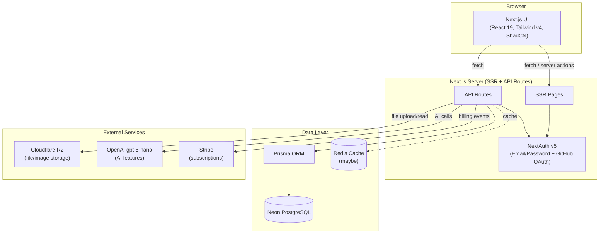
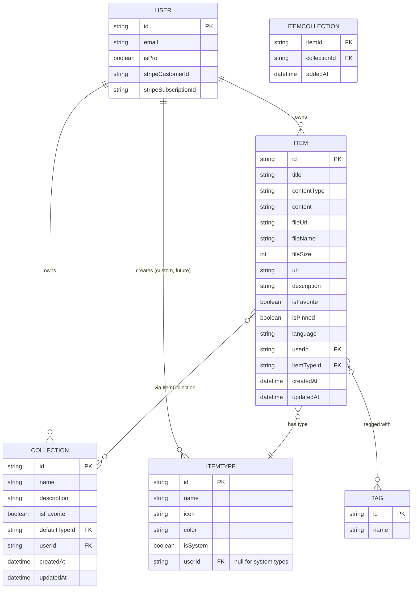
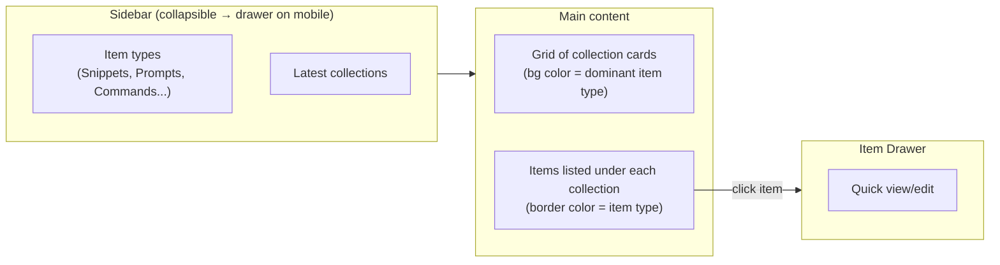

# DevStash — Project Overview

> One fast, searchable, AI-enhanced hub for all developer knowledge & resources.

---

## 1. Problem

Developers scatter their essentials across too many tools:

| Scattered today | Should live in DevStash |
|---|---|
| Code snippets | VS Code, Notion |
| AI prompts | Chat history |
| Context files | Buried in random project folders |
| Useful links | Browser bookmarks |
| Docs | Random folders |
| Commands | `.txt` files |
| Project templates | GitHub Gists |
| Terminal commands | Bash history |

**Result:** constant context switching, lost knowledge, inconsistent workflows.

**DevStash's answer:** a single, fast, searchable, AI-enhanced hub for all of it.

---

## 2. Target Users

| Persona | Core need |
|---|---|
| 🧑‍💻 **Everyday Developer** | Fast capture/retrieval of snippets, prompts, commands, links |
| 🤖 **AI-first Developer** | Save prompts, contexts, workflows, system messages |
| 🎓 **Content Creator / Educator** | Store code blocks, explanations, course notes |
| 🏗️ **Full-stack Builder** | Collect patterns, boilerplates, API examples |

---

## 3. Core Concepts

### Items & Item Types

Items are the atomic unit in DevStash. Every item has a **type**, which determines how its content is stored and rendered.

**System types** (built-in, cannot be edited/deleted by users):

| Type | Content Kind | Tier | Color | Icon (lucide) |
|---|---|---|---|---|
| `snippet` | text | Free | `#3b82f6` 🔵 | `Code` |
| `prompt` | text | Free | `#8b5cf6` 🟣 | `Sparkles` |
| `note` | text | Free | `#fde047` 🟡 | `StickyNote` |
| `command` | text | Free | `#f97316` 🟠 | `Terminal` |
| `link` | url | Free | `#10b981` 🟢 | `Link` |
| `file` | file | **Pro** | `#6b7280` ⚪ | `File` |
| `image` | file | **Pro** | `#ec4899` 🌸 | `Image` |

Custom user-defined types are planned as a **future Pro feature** (post-launch).

Content kinds map to storage:
- **text** → stored inline (`content` field)
- **url** → stored inline (`url` field)
- **file** → stored in Cloudflare R2, referenced via `fileUrl`

Items are created/viewed via a **quick-access drawer** — optimized for speed, not a full-page form.

### Collections

- A named grouping of items of *any* type (e.g. "React Patterns", "Interview Prep", "Context Files").
- **Many-to-many**: an item can belong to multiple collections simultaneously.
- Each collection can define a `defaultTypeId` — the type pre-selected when adding a new item to an empty collection.

### Search

Full search across:
- Content
- Tags
- Titles
- Types

### Other Features

- ⭐ Favorite items & collections
- 📌 Pin items to top
- 🕘 Recently used
- 📥 Import code from a file
- 📝 Markdown editor for text-based types
- 📤 File upload for `file` / `image` types
- 📦 Export data (multiple formats)
- 🌙 Dark mode (default)
- ↔️ Add/remove an item across multiple collections
- 🔗 View which collections an item belongs to

### AI Features (Pro only)

- 🏷️ AI auto-tag suggestions
- 📄 AI summaries
- 💡 "Explain this code"
- ✨ Prompt optimizer

---

## 4. System Architecture



### Entity Relationship Diagram



---

## 5. Prisma Schema (Draft)

> ⚠️ Draft only — not final. Per project rules: **never** run `prisma db push` or hand-edit the DB. All schema changes go through `prisma migrate dev` → applied to prod via a proper migration pipeline.

```prisma
// schema.prisma
generator client {
  provider = "prisma-client-js"
}

datasource db {
  provider = "postgresql"
  url      = env("DATABASE_URL") // Neon
}

// ---------- Auth (extends NextAuth) ----------

model User {
  id                   String   @id @default(cuid())
  name                 String?
  email                String   @unique
  emailVerified        DateTime?
  image                String?
  password             String?  // null if GitHub OAuth only

  isPro                Boolean  @default(false)
  stripeCustomerId     String?  @unique
  stripeSubscriptionId String?  @unique

  accounts             Account[]
  sessions             Session[]

  items                Item[]
  collections          Collection[]
  itemTypes            ItemType[]   // custom types (future)

  createdAt            DateTime @default(now())
  updatedAt            DateTime @updatedAt
}

// NextAuth v5 required models
model Account {
  id                String  @id @default(cuid())
  userId            String
  type              String
  provider          String
  providerAccountId String
  refresh_token     String?
  access_token      String?
  expires_at        Int?
  token_type        String?
  scope             String?
  id_token          String?
  session_state     String?

  user User @relation(fields: [userId], references: [id], onDelete: Cascade)

  @@unique([provider, providerAccountId])
}

model Session {
  id           String   @id @default(cuid())
  sessionToken String   @unique
  userId       String
  expires      DateTime

  user User @relation(fields: [userId], references: [id], onDelete: Cascade)
}

// ---------- Core Domain ----------

enum ContentType {
  text
  file
}

model ItemType {
  id       String  @id @default(cuid())
  name     String  // snippet | prompt | note | command | file | image | link
  icon     String  // lucide icon name
  color    String  // hex
  isSystem Boolean @default(false)

  userId   String? // null for system types
  user     User?   @relation(fields: [userId], references: [id], onDelete: Cascade)

  items    Item[]
  collectionsDefault Collection[] @relation("DefaultType")

  @@unique([userId, name])
}

model Item {
  id          String      @id @default(cuid())
  title       String
  contentType ContentType

  content     String?     @db.Text // null if file
  fileUrl     String?               // R2 URL, null if text
  fileName    String?
  fileSize    Int?

  url         String?               // for link type
  description String?
  language    String?               // optional, for snippets

  isFavorite  Boolean     @default(false)
  isPinned    Boolean     @default(false)

  userId      String
  user        User        @relation(fields: [userId], references: [id], onDelete: Cascade)

  itemTypeId  String
  itemType    ItemType    @relation(fields: [itemTypeId], references: [id])

  collections ItemCollection[]
  tags        ItemTag[]

  createdAt   DateTime    @default(now())
  updatedAt   DateTime    @updatedAt

  @@index([userId])
  @@index([itemTypeId])
}

model Collection {
  id            String   @id @default(cuid())
  name          String
  description   String?
  isFavorite    Boolean  @default(false)

  defaultTypeId String?
  defaultType   ItemType? @relation("DefaultType", fields: [defaultTypeId], references: [id])

  userId        String
  user          User     @relation(fields: [userId], references: [id], onDelete: Cascade)

  items         ItemCollection[]

  createdAt     DateTime @default(now())
  updatedAt     DateTime @updatedAt

  @@index([userId])
}

model ItemCollection {
  itemId       String
  collectionId String
  addedAt      DateTime @default(now())

  item       Item       @relation(fields: [itemId], references: [id], onDelete: Cascade)
  collection Collection @relation(fields: [collectionId], references: [id], onDelete: Cascade)

  @@id([itemId, collectionId])
}

model Tag {
  id    String @id @default(cuid())
  name  String @unique

  items ItemTag[]
}

model ItemTag {
  itemId String
  tagId  String

  item Item @relation(fields: [itemId], references: [id], onDelete: Cascade)
  tag  Tag  @relation(fields: [tagId], references: [id], onDelete: Cascade)

  @@id([itemId, tagId])
}
```

---

## 6. Tech Stack

| Layer | Choice | Notes / Docs |
|---|---|---|
| Framework | **Next.js 16 / React 19** | SSR pages + dynamic client components · [nextjs.org/docs](https://nextjs.org/docs) |
| Language | **TypeScript** | Strict mode recommended |
| Backend | **Next.js API Routes** | Items CRUD, file uploads, AI calls — single repo, one codebase |
| Database | **Neon (PostgreSQL)** | Serverless Postgres · [neon.tech/docs](https://neon.tech/docs) |
| ORM | **Prisma 7** | ⚠️ confirm latest API against current docs — [prisma.io/docs](https://www.prisma.io/docs) · migrations only, never `db push` |
| Caching | **Redis** (maybe) | For hot search/session data if needed |
| File storage | **Cloudflare R2** | Files & images (Pro) · [developers.cloudflare.com/r2](https://developers.cloudflare.com/r2/) |
| Auth | **NextAuth v5** | Email/password + GitHub OAuth · [authjs.dev](https://authjs.dev) |
| AI | **OpenAI `gpt-5-nano`** | Auto-tagging, summaries, code explain, prompt optimizer |
| Styling | **Tailwind CSS v4 + ShadCN UI** | [ui.shadcn.com](https://ui.shadcn.com) |
| Payments | **Stripe** | `stripeCustomerId` / `stripeSubscriptionId` on `User` |

> **Note:** verify Prisma 7 API details against current docs before implementation — flagged in your notes as "fetch latest docs."

---

## 7. Monetization

### Free Tier
- 50 items total
- 3 collections
- All system types **except** `file` / `image`
- Basic search
- No AI features

### Pro — $8/mo or $72/yr
- Unlimited items & collections
- File & image uploads
- Custom types *(later)*
- AI auto-tagging, code explanation, prompt optimizer
- Data export (JSON/ZIP)
- Priority support

> **Dev note:** foundation for Pro gating should be built now, but during development **all users get full access** regardless of `isPro`.

---

## 8. UI / UX

**Direction:** modern, minimal, developer-focused. References: **Notion, Linear, Raycast**.

- Dark mode by default (light mode optional)
- Clean typography, generous whitespace
- Subtle borders & shadows
- Syntax highlighting on code blocks

### Screenshots

Refer to the screenshots below as a base for the dashboard UI. It dose not have to be exact. Use it as a reference:

- @context/screenshots/dashboard-ui-main.png
- @context/screenshots/dashboard-ui-drawer.png

### Layout



- **Sidebar:** item-type shortcuts + recent collections
- **Main:** grid of color-coded collection cards, sized/colored by dominant item type
- **Item drawer:** fast open/edit without leaving the page
- **Responsive:** desktop-first, mobile-usable; sidebar collapses into a drawer

### Micro-interactions
- Smooth transitions
- Hover states on cards
- Toast notifications for actions
- Loading skeletons

---

## 9. Open Questions / Not Yet Finalized

- [ ] Redis caching — confirm whether needed at launch or deferred
- [ ] Custom item types — exact Pro-tier rollout timing
- [ ] Export formats — confirm exact list (JSON/ZIP mentioned; others?)
- [ ] `ItemType` uniqueness / naming collision rules between system and custom types
- [ ] Rate limiting / cost controls for `gpt-5-nano` AI calls
